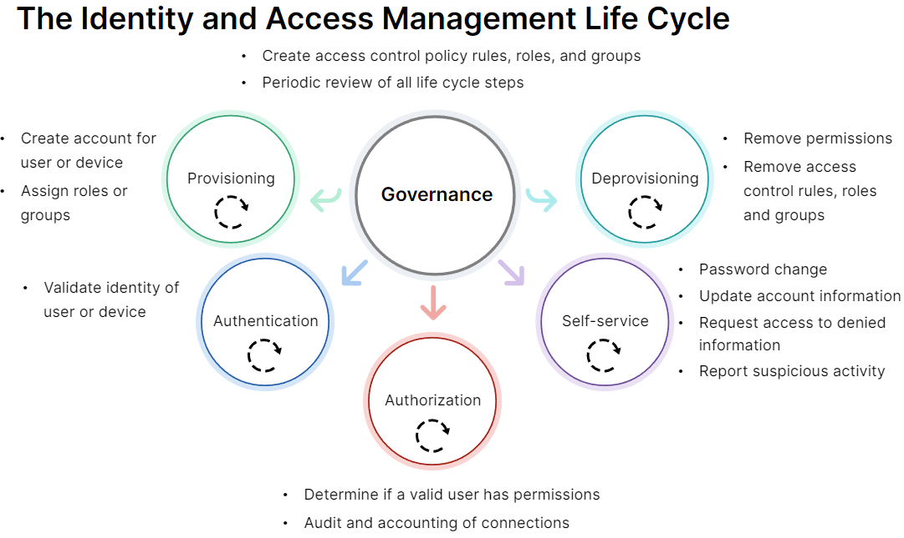

# Authentication and Access Control

- [Authentication and Access Control Overview](##Authentication-and-Access-Control-Overview)
- [Authentication Methods](##Authentication-Methods)
- [Single Sign-On](##Single-Sign-On)
- [Authentication Framework, Protocols, and Tools](##Authentication-Framework,-Protocols,-and-Tools)
- [Access Control and Methods](##Access-Control-and-Methods)
- [Access Control Best Practices](#Access-Control-Best-Practices)
- [Network Access Control](##Network-Access-Control)

## Authentication and Access Control Overview
---

La  ciberseguridad  requiere  la  capacidad  de  limitar  el  acceso  en  función  de  la  identidad  de  una  persona  o  dispositivo

- La  autenticación  se divide en:
    - Identificación: El  objeto  revela  su  identidad. El  sistema  confía  en  que  esa  es  su  identidad  incluso  sin  pruebas
    - Verificación:  El  objeto  debe  demostrar  que  es  quien  dice  ser

 

- La  autorización  basada  en  la  identidad  determina  qué  recursos  puede  leer,  modificar  o  eliminar  el  usuario

 

 

## Authentication Methods
---

Los  factores  de  autenticación  más  comunes  son:

 -  Inherencia: Basada  en  herencia  utiliza  un  rasgo  físico  único  que  posee  la  persona  que  se  autentica
 -  Posesión: Es  la  autenticación  que  utiliza  algo  que  usted  tiene  y  que  nadie  más  tiene,  misma  lógica 
se  aplica  a  las  firmas  digitales,   Al  registrar  su  dispositivo  con  un  autenticador

    Otras  formas  incluyen  tokens  de  hardware  o  software  y  mensajes  SMS,  utilizan  una  contraseña  de  un  solo  uso  (OTP) se  conocen  como  tokens  basados  en  eventos  y  tokens  basados  en  tiempo 

     Un  token  de  software instalado  en  un  dispositivo usan contraseña  de  un  solo  uso  basada  en  HMAC  (HOTP)  y  la  contraseña  de  un  solo  uso  basada  en  tiempo (TOTP)

 -  Conocimiento: Debe  divulgar  algo  que  solo  usted  y  el  autenticador saben (preguntas  y  respuestas o Q&A,   contraseña  o  un  número  de  identificación  personal  (PIN))
 -  Comportamiento: Identificación  de  voz,  Dinámica  de  pulsaciones  de  teclas  y Características  de  uso  del  ratón

Otros  factores contextuales pueden  afectar  el  proceso  de  autenticación como una ubicación inusual, comportamiento  de  la  entidad  es  inusual

La  autenticación  multifactor  (MFA)  brinda  al  autenticador  una  mayor  confianza  en  la  identidad  del  usuario

 

## Single Sign-On
---

Es  un  proceso  de  autenticación  mediante  el  cual  un  usuario  se  autentica  una  vez  y  puede  acceder  a  múltiples  recursos  en  muchos  
sistemas  y dominios

Esto  se  logra  cuando  el proveedor  de  identidad  (IdP) pasa  un  token  de  autenticación al proveedor  de  servicios  (SP)

protocolos de SSO,  como  OAuth  y  Security  Assertion  Markup  Language  (SAML),  se  basa  en  el  lenguaje  de  marcado  extensible  (XML), inserta declaraciones (denominan  afirmaciones  de  seguridad)  dentro  de  los  mensajes  basados  en  XML.  afirmación  de  autenticación(  incluye  la  fecha  y  la  hora) afirmación  de  atributo (  información  adicional)

las  afirmaciones  de  autorización  identifican  lo  que  la  entidad  tiene  derecho  a  hacer

FortiAuthenticator  es  un  producto  y  una  plataforma  de  autenticación

 

## Authentication Framework, Protocols, and Tools
---

- El  servicio  de  acceso  telefónico  de  usuario  con  autenticación  remota  (RADIUS)  es  un  protocolo  y  software  de  autenticación,  autorización  
y  contabilidad  (AAA)  de  cliente-servidor  que  permite  a  los  servidores  de  acceso  remoto  comunicarse  con  un  servidor  central  para  autenticar  a  los usuarios  que  acceden  telefónicamente  y  autorizar  su  acceso  al  sistema  o  servicio  solicitado

    RADIUS  también  puede  habilitar  el  marco  802.1x,  que  cifra  de  forma  única  las  sesiones  de  usuario

    Los  paquetes  de  datos  se  utilizan  para  intercambiar  datos  entre  dispositivos  informáticos  en  una  red  de  conmutación  de  paquetes

    Carga util: Son  unidades  de  datos  formateadas  que  consisten  en  información  de  control  y  datos  de  usuario

    Las  credenciales  de  usuario  se  pueden  almacenar  en  la  base  de  datos  del  servidor  RADIUS.  O  su  organización  puede  tener  información  de  usuario  ya  ingresada  en  otro  servidor

    los  servidores  RADIUS admiten  varios  protocolos  de  autenticación  y  tipos  de  servidores,  como  el  lenguaje  de consulta  estructurado  (SQL)  y  el  protocolo  ligero  de  acceso  a  directorios  (LDAP). LDAP  es  un  protocolo  de  aplicación  abierto,  independiente  del  proveedor  y  estándar  de  la  industria  para  acceder  a  servicios  de  directorio  a  través  de una  red  IP

    LDAP  es  un  protocolo  de  aplicación  abierto,  independiente  del  proveedor  y  estándar  de  la  industria  para  acceder  a  servicios  de  directorio  a  través  de  una  red  IP

    Caracteristicas:
    - Encripta  solo  las  contraseñas
    - Se  basa  en  UDP  como protocolo  de  transporte  de  red

 

- TACACS+  es  un  protocolo  AAA  remoto  que  permite  que  un  servidor  de  acceso  remoto  se  comunique  con  un  servidor  de  autenticación  para  validar  el  acceso  del  usuario

    Caracteristicas:
    - Encripta  todos  los  protocolos  AAA
    - Se  basa  en  TCP  como protocolo  de  transporte  de  red

 

- El  protocolo  de  autenticación  de  contraseñas  (PAP)  se  utiliza  para  autenticar  sesiones protocolo  punto  a  punto (PPP), esun  conjunto  de  protocolos  de  comunicación  informática  que  proporcionan  una  forma  estándar  de  transportar  datos  multiprotocolo  a través  de  enlaces  punto  a  punto, actuando en la capa  de  enlace  de  datos  del  modelo  OSI

-  El  protocolo  de  autenticación  de  desafío  (CHAP)  también  se  utiliza  para  autenticar  sesiones   pero  utiliza  un  protocolo  de  enlace  de  tres  vías

    Crea  una  frase  de  desafío  única  para  cada  sesión  de  autenticación  mediante  la  generación  de  una  cadena  aleatoria.  La  cadena  aleatoria  se  combina  con  un  resultado  hash  de  los  nombres  de  host  del  dispositivo.  Esto  garantiza  información  de  autenticación  dinámica  para  cada  sesión  y  evita  la  información  estática

     Microsoft  tiene  su  propia  versión  de  CHAP  denominada  MSCHAP

- Marco(framework)  para  la  autenticación  es  802.1x.   es  un  estándar  IEEE  para  el  control  de  acceso  a  redes  basado  en  puertos  (PNAC)

    Proporciona  un  mecanismo  de  autenticación  para  los  dispositivos  que  desean  conectarse  a  una  red  LAN  o  LAN  inalámbrica

    Involucra  a  tres  jugadores:  
    - un  suplicante, es  el  dispositivo  cliente  que  solicita  unirse  a  la  LAN
    - un  intermediario (también conocido como autenticador) conmutador Ethernet
o  un  punto  de  acceso  inalámbrico
    - un  servidor  de autenticación  admite  los  protocolos  RADIUS  y  EAP

        EAP  es  un  marco  de  autenticación,  no  un  mecanismo  de  autenticación, Existen  docenas  de  métodos  de  EAP:

        - EAP-FAST   autenticación  flexible  mediante  tunelización  segura:  Gestiona  la  autenticación  mediante  una  credencial  de  acceso  protegido  (PAC) generada  por  el  servidor  utiliza  el  protocolo  de  seguridad  de  la  capa  de  transporte  (TLS)  para  establecer  un  túnel  de  comunicación seguro  con  el  par

        - protocolo  EAP  protegido  (PEAP): encapsula  los  mensajes  EAP  dentro  de  un  túnel  TLS  cifrado  y  autenticado, utilizando  únicamente  certificados  del  lado  del  servidor

        - Lightweight  EAP  (LEAP): Cifra  las transmisiones  de  datos  mediante  claves  WEP generadas  dinámicamente  y  admite  la  autenticación  mutua  entre  un  cliente  inalámbrico  y  un servidor  RADIUS

 

 

## Access Control and Methods
---

El  control  de  acceso  es  la  capacidad  de  restringir  el  acceso  a  una  ubicación  física  o  un  recurso,  determina  lo  que  puede  hacer

Es  el  sistema  que  se  utiliza  para  determinar  a  qué  recursos  puede  acceder  un  usuario  en  función  de  la  autenticación

El  control  de  acceso  puede  ser:
- El  control  de  acceso  obligatorio  Mandatory Access Control (MAC): Obliga a  todos  los  usuarios  y  programas  a  verificar  siempre  el  motor  de  aplicación  antes  de  que  se  les  permita  el  acceso  a  los  recursos

- El  control  de  acceso  discrecional Discretionary Access Control (DAC) permite  cierta  flexibilidad  en  cuanto  a  quién  define  el  acceso

El control de acceso se basa en:
- El  control  de  acceso  basado  en  celosía Lattice-based access control (LBAC) es  un  modelo  que  otorga  permisos  a  ubicaciones  o  materiales  según  un  nivel  de  seguridad  asignado, Los usuarios  y  dispositivos  tienen  acceso  a  todo  lo  que  se  encuentre  en  su  nivel  o  por  debajo  de  él

- El  control  de  acceso  basado  en  un  conjunto  de  reglas, Rule-set-based access control (RSBAC) aplica  el  acceso  generalmente  a  través  de  una  lista  ordenada  de  reglas.  Las  reglas  se evalúan  generalmente  de  arriba  hacia  abajo, se  usa  comúnmente  en  las  reglas  de  acceso  de  firewall

- El  control  de  acceso  basado  en  roles, Role-based access control (RBAC) permite  el  acceso  a  recursos  según  los  roles  que  han  sido  definidos  por  los  administradores  y  asignados  a  los usuarios  o  dispositivos.  Estos  roles  se  asignan  a  un  conjunto  de  permisos

- El  control  de  acceso  basado  en  atributos, Attribute-based access control (ABAC)  puede  considerar  múltiples  atributos  para  determinar  si  se  debe  permitir  el  acceso.  Un  motor  de 
reglas  recopila  y  evalúa  atributos  en  función  de  una  política

    El beneficio es  la  capacidad  de  permitir  y  denegar  el  acceso de  forma  dinámica  en  función  de  múltiples  factores ( patrones  de  comportamiento,  geolocalización  y  cargas  de  recursos  actuales)

    La  definición  de  atributos puede  requerir  mucho  tiempo  y  recursos

 

 

## Access Control Best Practices
---

Un  sistema  de  gobernanza,  que  suele  ser  un  equipo  responsable  de  revisar  y  actualizar  los  métodos  y  políticas  de  control  de  acceso,  revisa y  modifica  el  proceso.  Debido  a  la  naturaleza  altamente  dinámica  de  la  autenticación  y  la  concesión  de  acceso,  es  importante  realizar revisiones  y  pruebas  periódicas  de  cada  etapa  del  ciclo  de  vida.

La  causa  de  la  mayoría  de  las  violaciones  de  seguridad  contra  activos  físicos  y  cibernéticos  es  el  error  humano

Tener  una  política  de  contraseñas  sólida,  que  requiera  una  gran  longitud,  caracteres  especiales  y  cambios  periódicos

El  principio  de  mínimo  privilegio,  o  PoLP,  y  la  arquitectura  de  confianza  cero,  o  ZTA,  son  dos  metodologías que  se  utilizan  para  definir  cómo  se  implementa  el  control  de  acceso

- PoLP,  permite  que  las  cosas  accedan  solo  a  lo  que  necesitan
- ZTA,   Es  una  metodología  para  hacer  cumplir  la  verificación  y autorización  de  todas  las  conexiones  a  los  recursos,  independientemente  de  dónde  provengan  las  conexiones.

  Las  políticas  de  control  de  acceso  basadas  en  atributos  se  utilizan  para  validar  atributos  como  el nombre  de  usuario,  las  propiedades  del  dispositivo  de  conexión  y  la  ubicación,  para  validar  la  conexión

  La  administración  rigurosa  de  las  políticas  es  fundamental  a  la  hora  de  establecer  el  control  de  acceso  y  de  revisar  y  mantener  una postura segura

  Un  usuario  bien  informado  es  una  poderosa  línea  de  defensa  en  muchos  aspectos  de  la  ciberseguridad, incluido  el  control  de  acceso

 

 

## Network Access Control
---

 El  control  de  acceso  a  la  red  (NAC)  es  un  dispositivo  o  una  máquina  virtual  que  controla  el  acceso  a  una  red

Evalúa  y  clasifica  el  cumplimiento  de  las  políticas  de  seguridad  por  usuario, dispositivo,  ubicación,  sistema  operativo

tienen  una arquitectura  centralizada

NAC  comenzó  como  un  método  de  autenticación  y  autorización  de  red  para  dispositivos  que  se  unen  a  la  red,  que  sigue  los  estándares  
IEEE  802.1X.  El  método  de  autenticación  involucra  a  tres  partes: 
- el  dispositivo  cliente:  conmutador  de  red  o  un  punto  de  acceso  inalámbrico
- el  autenticador:  proporciona  credenciales  en  forma  de  nombre  de  usuario  y  contraseña,  certificado  digital
- el  servidor  de  autenticación: reenvía  estas  credenciales  al  servidor

El  acceso  de  invitados,  el  uso  de  dispositivos  propios  (BYOD)  y  la  Internet  de  las  cosas  (IoT)  han  generado  problemas  complejos  para  la  seguridad  de  la  red

Cuando  MIS  introduce  NAC  en  una  red,  lo  primero  que  hace  NAC  es  crear  perfiles  de  todos  los  dispositivos  conectados

Cuando  se  concede  el  acceso  de  esta  manera,  la  red  se  segmenta  por función  del  dispositivo o por  perfil en el caso de  socios  e  invitados

NAC  permite  a  una  organización  administrar  y  autenticar  usuarios  y  dispositivos  temporales  a  través  de  un portal  de  autoservicio

NAC  se  puede  integrar  en  el  marco  de  seguridad,  de  modo  que  cuando  se  detecta  una  infracción,  responde  automáticamente  para notificar  al  centro  de  operaciones  de  seguridad  (SOC)

NAC  se  integra  con  otros  productos  de  puntos  de  seguridad,  como  conmutadores  y  soluciones  de  red,  a  través  de  la  interfaz  de  
programación  de  aplicaciones  (API)  abierta/RESTful  o  shell  seguro  (SSH)

 FortiNAC   