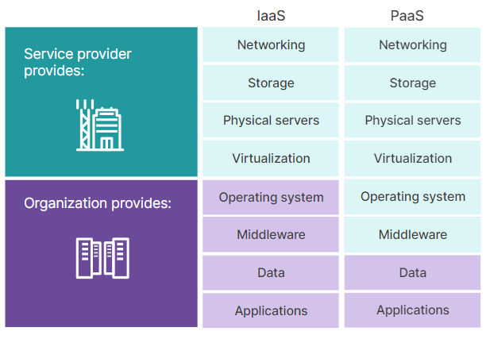
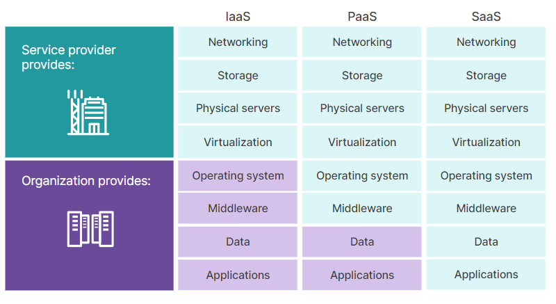
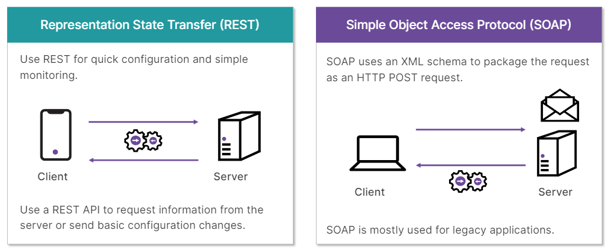

# Cloud Security and Virtualization

- [Cloud Security and Virtualization Overview](#Cloud-Security-and-Virtualization-Overview)
- [Cloud Security](#Cloud-Security)
- [Virtual Machine Risks](#Virtual-Machine-Risks)
- [Common Cloud Threats](#Common-Cloud-Threats)
- [Cloud Hosted Security Services](#Cloud-Hosted-Security-Services)
- [Securing the Cloud](#Securing-the-Cloud)

## Cloud Security and Virtualization Overview

 

 

## Cloud Security

Los  centros  de  datos  se  transformaron  de  filas  de  hardware  informático  dedicado  a  aplicaciones  específicas a  una  colección  (o  grupo)  de  recursos  de  hardware  generales  que  ejecutaban  aplicaciones  virtualizadas

- La  IaaS  proporciona  a  las  organizaciones  redes,  almacenamiento, servidores  físicos  y  virtualización

    El  proveedor  solo  es  responsable  de  proteger  la  infraestructura que  proporciona

    El cliente es  responsable  de  proteger  el acceso,  el  tráfico  de  red  y  las  aplicaciones  de  datos

    El  middleware  es  un  software  que  actúa  como  puente  entre  el  sistema  operativo  y  las  aplicaciones

- Plataforma  como  servicio  o  PaaS,  proporciona  el  sistema  operativo  y  el  middleware además  de  los  elementos  que  proporciona  la  IaaS

    

- Software  como  servicio  o  SaaS,  el  software  está  alojado  por  un  tercero

    

La  seguridad  es  una  responsabilidad  compartida  entre  el  proveedor  de  la  nube  y  el  cliente  que  utiliza  los  servicios  en  la  nube

 

 

## Virtual Machine Risks

La  virtualización  es  el  proceso  de  utilizar  un  único  recurso  de  hardware  físico  para  crear  múltiples  instancias  virtuales  de  dispositivos  en  funcionamiento,  como computadoras

Aspectos a tener en cuenta para proteger  los  recursos  virtuales: 
- La  seguridad  física  del  hardware 
- La  del  hipervisor,   El  software  del  hipervisor  que  se  ejecuta  en  el  servidor  físico  tiene  acceso  directo  a  todas  las  máquinas virtuales  que  se  ejecutan  en  él

Para  proteger  las  máquinas  virtuales,  debe  comenzar  con  prácticas  similares  a  las  que  utiliza  para  proteger  los  dispositivos  tradicionales,  entre  ellas:
- Aplicar  parches  al  sistema  operativo  y  a  las  aplicaciones  periódicamente
- Utilizar  políticas  de  gestión  de  acceso  con  contraseñas  seguras
- Instalar  firewalls  virtualmente  en  el  entorno  en  línea  con  las  VM  protegidas
- Implementar  la  segmentación  de  la  red  en  la  nube  para  reducir  la  superficie  de  ataque

Además  de  las  prácticas  de  seguridad  habituales,  las  consideraciones  específicas  de  la  virtualización  incluyen:
- Limitar  la  conectividad  entre  la  VM  y  el  host  para  segmentarlos  y  evitar  la  posible  propagación  de  virus a  través  de  actividades  como  compartir  archivos
- Eliminar  piezas  innecesarias  de  hardware  virtual  para  reducir  la  superficie  de  ataque
- Evitar  la  proliferación  de  la  virtualización  mediante  la  implementación  de  una  planificación  y  supervisión  adecuadas  de  la  gestión  de  máquinas  virtuales,  como  permitir, Sólo  administraciones  específicas  pueden  implementar  una  lista  estándar  de  imágenes  de  máquinas  virtuales  validadas
- Restringir  el  acceso  físico  y  administrativo  al  hipervisor

Amenazas especificas:
- escape  de  la  máquina  virtual
- remanencia  de  datos,   representación  residual  de  los  datos  digitales
- ataques  de  escalada  de  privilegios

Para  garantizar  la  disponibilidad  y  la  recuperación  ante  desastres,  la  virtualización  permite  que  las  máquinas  virtuales  se  muevan  de  un  servidor  o  hipervisor  a  otro

 

 

## Common Cloud Threats

La  mayor  amenaza  para  las  nubes  públicas  y  los  entornos  virtuales  se  percibe  como  errores  en  la  configuración,  la  instalación (setup) y  la  implementación (deployment)

Los  riesgos  de  seguridad  más  comunes  para  los  entornos  de  nube  incluyen:

- Autenticación  y  autorización:  principio  del  mínimo  privilegio

- Aumento  de  la  velocidad  de  las  máquinas  virtuales:   eliminan  o  borran  correctamente  después  de  su  uso

- Almacenamiento  mal  configurado:  Proteger  y  configurar  de  forma  sólida  estos  contenedores,  discos,  buckets  y  blobs  para  evitar  el  uso  excesivo  de  recursos

- Pérdida  de  datos:   usar  plataformas  de  prevención  de  pérdida  de  datos  y  mantener  el  registro  y  otras  herramientas  de  seguridad y cómo  las  empresas  de  administración  de  la  nube  manejan  el  almacenamiento,  los derechos  y  la  propiedad  de  los datos

- Conectividad:  utilice  siempre  protocolos  de  red  seguros  como  HTTPS  y  SSH  al  conectarse  a  servicios  y  dispositivos  en  la  nube  y  realizar  tareas  de mantenimiento

-  Registro  y  monitoreo  inadecuados:  Las  empresas  de  servicios  en  la  nube  pueden  tener  métodos  muy  diferentes  para  mantener  y  guardar  registros

- Derechos  y  propiedad  de  los  datos:   La  propiedad  de  los  datos  depende  del  país  de  la empresa  que  desea  utilizar  los  servicios  en  la  nube,  del  país  en  el  que  está  constituido  el  proveedor  de  servicios  en  la  nube  y  de  los  acuerdos  de  nivel  de  servicio (SLA)  firmados  por  la  empresa  y  el  servicio  de  alojamiento

Sistemas  de  autenticación  como  OAuth  y  SAML basados  en  tokens  permiten  que  los  usuarios  y  dispositivos  se  conecten  a  una  amplia  variedad  de  servicios, resulta  útil  cuando  se  accede  a  recursos  en  la  nube  a  través  de  múltiples  plataformas

Utilizar  el  uso  compartido  de recursos  de  origen  cruzado  (CORS)  para  permitir  el  uso  compartido  de  recursos  entre  sitios  web

El  monitoreo  en  tiempo  real  del  estado  de  los  sistemas,  el  almacenamiento  y  las  conexiones  en  la  nube  asociados  puede  resultar  invaluable

 

 

## Cloud Hosted Security Services

Un  firewall  basado  en  la  nube  puede  reemplazar  un  firewall  alojado  localmente  y  centralizar  la  seguridad  de  la  red  en  un  solo  lugar,  permitiendo  que  solo  el  tráfico  de  la  red  local  se  enrute  a  cada  sucursal  a  través  de  una  red  privada  virtual  (VPN)  segura, ademas puede proporcionar una  capa  adicional de  protección  contra  posibles  atacantes

Las  puertas  de  enlace  de  correo  electrónico  seguras  se  pueden  alojar  en  la  nube,  lo  que  permite  escanear  y  verificar  todo  el  correo  electrónico  entrante  en  la  nube  antes  de  reenviarlo  a  un  servidor  de  correo  electrónico  local

Los  WAF  basados  en  la  nube  se  ubican  frente  a  los  servidores  web  alojados  en  la  nube  para  brindar  equilibrio  de  carga,  seguridad  y  escalabilidad  a  grandes granjas  web  alojadas  en  la  nube

La  autenticación  basada  en  la  nube  ayuda  a  las  empresas  a  alojar la  gestión  de  identidad  y  acceso  (IAM),  el  inicio  de  sesión  único  (SSO)  y  la  autenticación  de  dos  factores   
Un  agente  de  seguridad  de  acceso  a  la  nube  o  CASB,  que  permite  autenticar  y  controlar  el acceso  de  los  usuarios  a  las  aplicaciones  basadas  en  la  nube,  independientemente  de  dónde  provengan  los  usuarios  y  cómo  se  autentiquen

Aislamiento  de  navegador  remoto  (RBI),  es  una  instancia  SaaS  de  navegador  web que  se  ejecuta  en  la  nube  y  se  comporta  como  un  navegador  web  normal  instalado  localmente, permite  controlar  todas  las  conexiones  de  red  y  el  acceso  a  los  archivos  en  un  entorno  protegido,  facilita  la  defensa   contra  ataques  de  secuencias  de  comandos  entre  sitios  (XSS)

Tener  la  información  y  la  gestión  de  seguridad  centralizadas  en  la  nube  también  fortalece  a  los  centros  de  operaciones  de  seguridad  o  SOC  para  monitorear  adecuadamente  los  indicadores  de  compromiso  (IOC) y  un  sistema  de gestión  de  eventos  e  información  de  seguridad  (SIEM) 

Las  empresas  de  seguridad que ofrecen servicios para realizar  evaluaciones  de  seguridad  y  pruebas  de  penetración se denomina  protección  nativa  de  la  nube  o  CNP,  o  protección  de  aplicaciones  nativas  de  la  nube  o  CNAP

SECaaS  permite  a  las  empresas  utilizar  un  único  proveedor  para  proporcionar  múltiples  herramientas  y  dispositivos  de  seguridad  en  línea,  todos integrados  en  una  única  plataforma  CNP

El  servicio  de  acceso  seguro  en  el  borde,  o  SASE,  es  un  modelo  de  arquitectura  en  la  nube  que  combina  funciones  de  red  y  SECaaS

 

 

## Securing the Cloud

Además  de  los  cortafuegos,  puede  alojar  escáneres  de  prevención  de  pérdida  de  datos,  motores  antivirus  y  entornos  aislados  en  la  nube para  proporcionar  servicios  de  seguridad  inmediatos  que  los  usuarios  se  autentiquen  a  través  de  un  vínculo cifrado,  como  SSL,  o  mediante  una  VPN

Debe  proteger  los  servidores  de  autenticación  alojados  en  la  nube,  como  Active  Directory  o  LDAP,  mediante  CNF  y  conexiones  que  se  implementen mediante  el  principio  de  privilegio  mínimo 

Un  proxy  inverso  se  coloca  delante  de  los  servidores  y  las  aplicaciones  que  se  van  a  proteger para que verifique  y  autentique todas  las  conexiones  entrantes  antes  de  pasar  el  tráfico  al  servidor  de  destino

Los  servidores  CASB  pueden  usar  API  para  comunicarse  directamente  con  los  proveedores  de  aplicaciones  en  la  nube  para  configurar  y  permitir  el acceso  a  usuarios  autorizados  y  escanear  los  datos  almacenados  por  la  aplicación  para  garantizar  la  seguridad  y  evitar  la  pérdida  de  datos

Hay  dos  tipos  principales  de  API:  transferencia  de  estado  de  representación  (REST)  y  protocolo  simple  de  acceso  a  objetos  (SOAP)

Puede  proteger  las  API  cifrando las  conexiones  entre  ellas  mediante  HTTPS,  VPN  entre  el  cliente  y  el  servidor  o  una  puerta  de  enlace  de  API

Una  puerta  de  enlace  de  API  es  un  WAF  que puede  identificar  y  escanear  conexiones  de  API  y  aplicar  seguridad, para ello  verifica  la  autenticación  utilizada  por  la  sesión  de  API  y  aplica  esquemas  de API (conjunto  de  comandos  y  llamadas  de  API  que  se  espera  que  utilice) Esto  garantiza  que  la  sesión  de  API utilice  solo  comandos  aprobados  y  evita  que  actores  maliciosos  inyecten  comandos  en  la  API