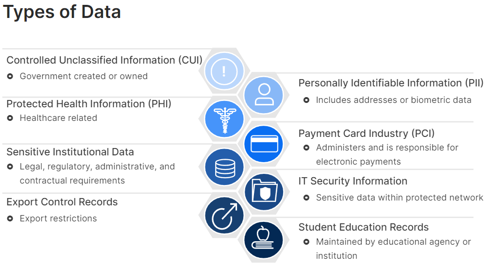

# Secure Data and Applications
- [Secure Data and Applications Overview](#Secure-Data-and-Applications-Overview)
- [Data Protection](#Data-Protection)
- [Data Privacy](#Data-Privacy)
- [Secure Email Gateway SEG](#Secure-Email-Gateway-SEG)
- [Firewall de Aplicaciones Web WAF](#Firewall-de-Aplicaciones-Web-WAF)
- [Content Filters](#Content-Filters)
- [Application Hardening Techniques](#Application-Hardening-Techniques)

## Secure Data and Applications Overview

Quienes  almacenan  datos  confidenciales  sean  responsables  de  su  seguridad  
La  protección  de  los  datos  es  un  esfuerzo  continuo  durante  todo  el  ciclo  de  vida  de  los  mismos  
Los  filtros  de  contenido  ayudan  a  administrar  los  datos  al  restringir  el  acceso  a  información  confidencial  o  dañina

 

 

## Data Protection

Debe garantizar:
- Integridad: garantiza que los datos son auténticos, precisos, fiables y no están manipulados. Firmas digitales, hashing
- Confidencialidad: mantener la privacidad de los datos. Encriptacion
- Disponibilidad
- No repudio: Es el proceso que impide que alguien niegue haber realizado una acción que en realidad ha llevado a cabo. Una clave privada se utiliza con fines de identificación

Soberanía  de  los  datos, significa  que  los  datos  están  sujetos  a  las  leyes  y  estructuras  de  gobernanza  del  país  donde  se  almacenan

Etapas del  ciclo  de  vida  de  los  datos: 
- Creacion
- Almacenamiento
- Uso
- Archivo
- Destruccion

Los datos  pasan  de  un  estado  a  otro  se  encuentran  en  constante  movimiento entre  reposo,  tránsito  y  uso

La  resiliencia  de  los  datos  es  importante  para  la  disponibilidad  y  la accesibilidad

la  prevención  de  pérdida  de  datos  (DLP)  permite  detectar  y  prevenir  violaciones  de  datos,  exfiltración  o  destrucción  no deseada  de  datos  confidenciales, La  DLP  ayuda  a  las  organizaciones  a:  
- Identifique  información  confidencial  en  múltiples  sistemas  locales  y  basados  en  la  nube.
- Evitar  el  intercambio  accidental  de  datos.
- Auditar  y  monitorear  los  movimientos  de  datos
- Educar  a  los  usuarios  sobre  cómo  cumplir  con  las  normas

DLP  reduce  los  riesgos  al  tiempo  que  mejora  el  cumplimiento  normativo

Para  una  protección  completa  de  los  datos  mientras  están  en  uso,  en  tránsito  o  en  reposo,  puede  implementar  DLP  en  estas  diferentes  partes  de  una  red:
- El  punto  final,  generalmente  como  un  cliente  basado  en  software  en  una  computadora  portátil  o  una  estación  de  trabajo
- El  nivel  de  red,  generalmente  en  el  perímetro  para  detectar  datos  en  tránsito
- El  lugar  de  almacenamiento,  es  decir,  en  los  servidores  del  centro  de  datos  para  inspeccionar  los  datos  en  reposo
- En  la  nube,  como  software  como  servicio  (SaaS)  que  protege  los  datos  almacenados  en  servicios  en  la  nube

 

 

## Data Privacy

La  privacidad  de  datos  se  refiere  al  manejo  adecuado  de  datos  personales  y  otros  tipos  de  datos  sensibles e incluye la privacidad  del  público  y  el  derecho  a  tener  control  sobre  sus  propios  datos  personales

las  organizaciones  deben:
- Identificar  activos  de  datos  sensibles  y  clasificar  la  gravedad  del  impacto  de  dichos  activos.
- Identificar  roles,  usuarios  y  políticas  autorizados  para  la  retención  de  datos  privados.
- Recopilar  e  informar  sobre  la  vulneración  de  activos  de  datos.
- Desarrollar  procedimientos  de  respuesta  oportunos  que  detallen  cómo  notificar  a  las  partes  interesadas  sobre  fugas  o  violaciones  de  datos,  y  cómo recuperarse  eficazmente  de  un  compromiso
- Implementar  medidas  criptográficas  para  la  ofuscación  de  datos

A  todos  los  activos  de  información  se  les  debe  asignar  un  nivel  de  clasificación  de  datos,  como  Restringido,  Confidencial,  Interno  o  Público

Las  leyes  y  regulaciones  de  privacidad  de  datos  existen  para  garantizar  que  las  personas  tengan  control  sobre  sus  datos

La  protección  de  este  derecho  se  ha  reflejado  en  muchas  leyes  de  protección  y  privacidad  de  datos,  entre  ellas,  GDPR,  ISO  27701,  NIST  SP800 53,  SOC  2,  PIPEDA,  CCPA,  HIPAA  y  PCI  DSS

 

 

## Secure Email Gateway SEG

SEG  es  una  solución  tecnológica diseñada  para  proteger  a  las  organizaciones  de  las  amenazas  basadas  en  el  correo  electrónico  y  garantizar  la  seguridad  y  privacidad  de  sus  comunicaciones  por  correo electrónico.  Funciona  como  una  barrera  entre  la  infraestructura  de  correo  electrónico  de  una  organización e Internet. Funciones:
- Filtros  de  contenido: Se  utilizan  para  controlar  y  administrar los  tipos  de  contenido  a  los  que  se  puede  acceder  o  compartir  en  una  red,   incluye spam, datos  inapropiados  o confidenciales
- Prevención  de  pérdida  de  datos  (DLP)
- Autenticación  y  verificación  de  identidad,  para  evitar  la  suplantación  de  identidad  y  la  falsificación  de  correo  electrónico
- Filtrado  de  malware, analiza  los  archivos  adjuntos  y  los  enlaces  de  correo  electrónico  en  busca  de  malware
- Puede  cifrar  el  correo  electrónico  para  proteger  el  contenido  del  acceso  no autorizado  durante  la  transmisión
- Se integra  con  firewalls  y  soluciones  de  sandbox

Sender  Policy  Framework  (SPF)  también  funciona  a  nivel  del  servidor  de  correo  electrónico  receptor, ayuda  a  evitar  la  suplantación  de  correo  electrónico   
Funciona  junto  con  otras  tecnologías  de  autenticación  de  correo  electrónico  como  DomainKeys  Identified  Mail  (DKIM)  y  Domainbased  Message Authentication,  Reporting,  and  Conformance  (DMARC)  para  brindar  una  seguridad  integral  del  correo  electrónico

 

 

## Firewall de Aplicaciones Web WAF

Es  un  dispositivo  o  software  que  supervisa  el  tráfico  HTTP/HTTPS  y  puede  bloquear  el  tráfico malicioso  hacia  y  desde  una  aplicación  web

FortiWeb protege  tanto  las  aplicaciones  web  como  las  interfaces  de  programación  de  aplicaciones  (API)  contra  las  10  principales  amenazas  de  OWASP,  ataques  DDOS,  ataques  de  bots  y  más.  FortiWeb  utiliza  funciones  avanzadas  basadas  en  ML  para  brindar  protección en  tiempo  real  contra  amenazas  conocidas  y  desconocidas.  FortiWeb  puede  integrarse  con FortiGate  y  FortiSandbox

 

 

## Content Filters

Tipos  más  comunes  de  filtros  de  contenido  incluyen:  

- Filtros  de  motores  de  búsqueda: Clasifican  el  contenido  web  según  su  texto  e  imágenes, tienen  un  peso  específico y el  contenido  se  puede  clasificar  como  seguro,  moderado, inapropiado  o  rechazado  desde  un  punto  de  vista  estricto

- Filtros  de  correo  electrónico: Comprueban  el  encabezado  de  los  correos  entrantes  comparándolos  con  listas  negras  en  tiempo  real, verifican  los  archivos  adjuntos,  identifican  palabras  claves

- Filtros  de  contenido  basados  en  DNS: comprueban  el  sitio  web  durante  la  resolución  del  dominio  a  través  de  servidores  DNS  mediante  listas  de  bloqueo/permitidos

- Filtros  web: son  similares a los basados  en  DNS  con  una  función  adicional  que  categoriza  los  sitios  web

 

 

## Application Hardening Techniques

El  endurecimiento  es  un  requisito  de  seguridad  recomendado  que  se  define  en  diversas  normas  y  regulaciones  de  ciberseguridad, yuda  a  minimizar  las  vulnerabilidades  y  reduce  la  superficie  de  ataque

Las  organizaciones  buscan  garantizar  la  seguridad  de  su  lugar  de  trabajo  reforzando  el  uso  de  herramientas  y  aplicaciones  aprobadas  por  la  empresa  y  capacitando a  los  empleados

El  proxy  puede  filtrar  sitios  restringidos  y  aumentar el  uso  del  ancho  de  banda  mediante  el  almacenamiento  en  caché  y  el  filtrado  de  contenido

Eliminar  o  deshabilitar  aplicaciones  obsoletas