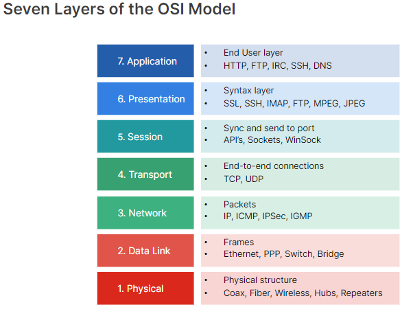
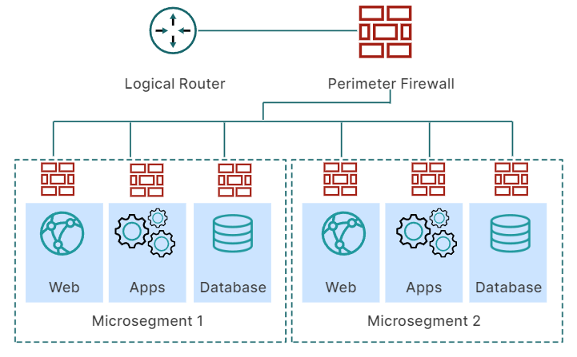
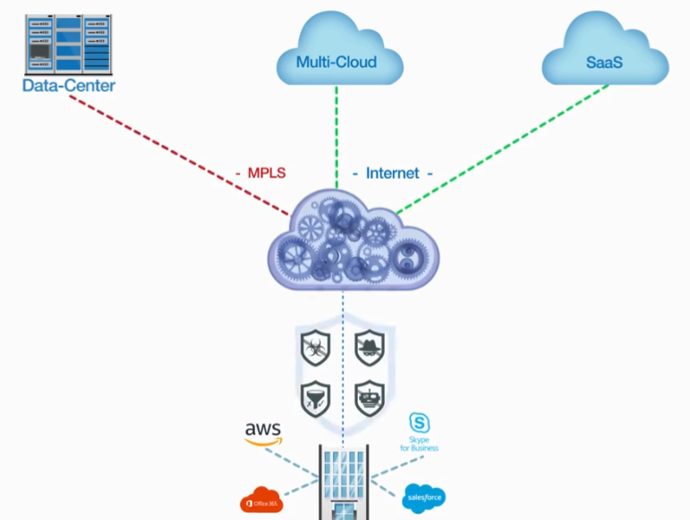

# Module 2: Secure Network

- [Secure Network Overview](#Secure-Network-Overview)
- [Secure Perimeter](#Secure-Perimeter)
- [Zero Trust Principles](#Zero-Trust-Principles)
- [Centralized Security Network Management](#Centralized-Security-Network-Management)
- [Secure SD-WAN](#Secure-SD-WAN)
- [SASE](#SASE)
- [Network Segmentation](#Network-Segmentation)
- [Firewalls](#Firewalls)
- [Secure Switching and Ports](#Secure-Switching-and-Ports)
- [Security Protocols](#Security-Protocols)
- [Sandbox](#Sandbox)
- [Common Network Threats and Prevention](#Common-Network-Threats-and-Prevention)

## Secure Network Overview

## Secure Perimeter

El  perímetro  seguro  puede  filtrar  el  tráfico  en  diferentes  capas  OSI.

En  la  capa  de  enlace  de  datos,  crear  una  lista  de  control  de  acceso  (ACL) y filtar por medio de la MAC

En  la  capa  de  transporte:
- filtrado  de  paquetes  permite  o  rechaza  paquetes  en  
función  de  un  conjunto  de  reglas  configuradas. El filtrado puede ser:
    - Sin estado:  cada  paquete  se  comprueba  en  función  de  sus  direcciones IP,  puertos  de  origen  y  destino  y  protocolo.
    - Con estado:   el  dispositivo  de  seguridad  realiza un  seguimiento  de  la  comprobación  de  5  tuplas  y  del  estado  de  la  conexión  TCP/IP,  el  tráfico  de  retorno  se  valida  solo  si  coincide  con  el  tráfico  entrante  correspondiente
    
- filtrado  de  traducción  de  direcciones  de  red  (NAT): puede traducir  una  dirección  IP  pública  a  una  dirección  IP  privada  y  una  dirección  IP  privada  a  una  dirección  IP  pública.

En  la  capa  de  aplicación:
-  filtrado  de  proxy:   un  dispositivo  perimetral  seguro  puede  proporcionar   puerta  de  enlace  oculta  al  usuario  interno  de  Internet.
- application layer gateway (ALG): Abre  puertos  de  datos  TCP/UDP  de  forma  dinámica sólo  para  las  sesiones  correspondientes

 

## Zero Trust Principles

Un  concepto  o  estrategia  de  seguridad  que  tiene  tres  principios  básicos:
 - Nunca confiar  en  un  usuario  o  dispositivo: 
    - Autenticar  a  un  usuario  o  dispositivo  para  determinar  su  identidad
    - Autorizar, verificar  a  qué  recursos  está autorizado  a  acceder el  usuario  o  dispositivo
    - Medidas:  
        - Exigir  la  identidad  de  los  usuarios  y  dispositivos  de  forma continua 
        - Autenticación  multifactor (MFA)
        - Restricciones  de  acceso  a  la  red  y  a  los  recursos  también  pueden  basarse  en  el  contexto (  la  hora  y  la  fecha  de  la  solicitud,  la  ubicación  geográfica  del  dispositivo  que  solicita  acceso  y  la  postura  de  seguridad  del  dispositivo)
 - Implementar  el  privilegio  mínimo, los  usuarios  y  dispositivos  tienen  acceso  solo  a  los  recursos  que  necesitan  para completar  sus  trabajos
    - Medidas:
        - Privileged access management (PAM)
            - Administrador de accesos: Gobierna el acceso a cuentas privilegiadas, definiendo y aplicando políticas
            - Bóveda de contraseñas: Almacena de forma segura las contraseñas
            - Administrador de sesiones: Monitorea las acciones realizadas durante sesiones privilegiadas
        - Definir  la  superficie  de  protección: Identificar los recursos de la red, evaluar el grado de confidencialidad y determinar qué funciones necesitan acceder a ellos
        - Aplicar  el  método  Kipling: técnica de análisis y resolución de problemas basada en seis preguntas
            - ¿Qué? (What?): Identifica el problema o situación.
            - ¿Por qué? (Why?): Explora las razones o causas.
            - ¿Cuándo? (When?): Determina el marco temporal.
            - ¿Cómo? (How?): Examina los métodos o procesos.
            - ¿Dónde? (Where?): Establece la ubicación o contexto.
            - ¿Quién? (Who?): Identifica a las personas involucradas.
 - Asumir  que  la  red  ya  está  vulnerada

La  transformación  empresarial  está  obligando  a  las  redes  a  descentralizarse proporcionado muchos más vectores de ataque

Las  redes  perimetrales  son  unidades (Endpoints, servidores) cerradas  y  autónomas  con  cortafuegos

Las VPN  proporcionan  conexiones  seguras  para  usuarios  remotos  y  entre  redes  de  área  local

Segmentar  la  red  en  secciones  más  pequeñas  para  restringir  el  movimiento  lateral  de  los  contagios

Acceso  de  confianza  cero  (ZTA):  utiliza  un  control  de  acceso basado  en  roles

Agentes  de  software  de  punto  final proporcionan informacion sobre  el dispositivo,  como  el  sistema  operativo,  el  nivel  de  parche,  el  software  instalado  en  el  dispositivo,  etc. y poder evaluar  el  nivel  de  riesgo  que  el  dispositivo  podría  representar  para  la  red

El  control  de  acceso  a  la  red  (NAC)  identifica  los  dispositivos  en  la  red brindando visibilidad y control

ZTNA  es  una  tecnología  que  establece  una  sesión  segura  automáticamente  entre  la  entidad  final  y  la  red independientemente  de  la  ubicación

 

## Centralized Security Network Management

La  gestión  centralizada  de  la  red  de  seguridad  se  refiere  al  acto  de  recopilar  datos  relacionados  con  la  seguridad  de  varios  dispositivos  y  aplicaciones  en  una  ubicación  central.
- simple network management protocol (SNMP)
- application programing interface (API)

Fortinet Security Fabric es un enfoque integral de seguridad que proporciona protección de extremo a extremo para las organizaciones:
- Componentes clave: Incluye dispositivos como FortiGate (firewall), FortiAnalyzer (análisis), FortiManager (gestión centralizada), FortiClient (protección de endpoints), entre otros.

- Fabric Connectors: Permite la integración con sistemas de terceros como nubes públicas, SDN, etc.

Fabric  Management  Center  ofrece  una  visión  amplia  de  la  seguridad  y  la  red  con  visibilidad  de  extremo  a  extremo

 Security  Fabric  se  vincula  con  la  seguridad  impulsada  por  IA  de  FortiGuard  para  permitir  una  detección  rápida  y  coordinada

 

## Secure SD-WAN

 (Software-Defined Wide Area Network) es una tecnología de red de área amplia, ofrece una forma eficiente y flexible de gestionar redes empresariales distribuidas que dependen de la nube y las conexiones remotas

- Funcionamiento:
    - Crea una superposición virtual independiente del transporte subyacente (internet, fibra, LTE, MPLS, etc).
    - Utiliza un controlador centralizado para gestionar políticas y configuraciones.
    - Enruta automáticamente el tráfico por la ruta óptima en tiempo real.
    - Aprovecha múltiples conexiones simultáneamente para mejorar el rendimiento.
- Componentes principales:
    - Controlador centralizado
    - Dispositivos SD-WAN Edge en las sucursales
    - Gateways virtuales
    - Software de orquestación y gestión
- Beneficios:
    - Mejor rendimiento y confiabilidad de la red
    - Reducción de costos al poder usar conexiones de internet comerciales
    - Gestión simplificada y centralizada
    - Mayor agilidad y flexibilidad
    - Optimización para aplicaciones en la nube
    - Implementación sin contacto en sitios remotos

 

<!----> 

 MLS (Multiprotocol Label Switching): mecanismo de transporte de datos que utiliza etiquetas para enrutar el tráfico de red SD-WAN es una mejor alternativa, más costoso debido a la necesidad de líneas dedicadas de alta calidad

   
 
 LTE (Long Term Evolution) es un estándar de comunicaciones móviles de cuarta generación (4G)

 

## SASE

Secure  Access  Service  Edge

- Red  de  área  amplia  definida  por  software  (SD-WAN)
- gateway  web  seguro  (SWG); 
- acceso  a  red  de  confianza  cero  universal  (ZTNA); 
- agente  de  seguridad  de  acceso  a  la  nube  (CASB):  Protege  las  aplicaciones  en  la  nube  alojadas  en  nubes  públicas  (IaaS),  nubes  privadas  o   SaaS.
Evita  fugas  de  datos,  infecciones  de  malware,  incumplimiento  normativo 

- firewall  como  servicio  (FWaaS):   firewall  de  próxima  generación  (NGFW)  sistema  de  prevención  de  intrusiones  (IPS),  antimalware,  inspección  
SSL  y  Sandbox.
 26

- Gestión  centralizada

FortiSASE  integra  la  conectividad  SDWAN  con  el  borde  del  servicio  de  seguridad  (SSE)

 

## Network Segmentation

Zona desmilitarizada (DMZ):  servidores  a  los  que  se  desea  que  se  pueda  acceder  desde  Internet.  El  tráfico  se  clasifica como norte-sur

Se puede compartimentar mas mediante la  microsegmentación   cada  recurso  (hosts, usuarios,  aplicaciones,  etc.)  se  identifica  y  protege  de  forma  única a traves  de la confianza zero.  El  tráfico  se  clasifica como este-oeste

 Una  red  se  puede  segmentar  en  segmentos  físicos  o  lógicos

Estos  diferentes  métodos  de  segmentación  se  realizan  en  los  distintos  niveles  del  modelo  OSI

- En  la  capa  de  enlace  de  datos,  se  implementa  un enfoque  de  segmentación  lógica  utilizando  redes  de área  local  virtuales  (VLAN)

- En  la  capa  de  red, se implementa un enfoque de  segmentación  física, se  divide  en  subredes.  El  flujo  de  datos  entre  las  diferentes subredes  está  limitado  y  controlado  a  través  de  políticas  de  firewall,  listas  de  control  de  acceso  (ACL)  y  enrutadores

- En la capa de aplicacion, se implementa SD-WAN, la  red  física,  también conocida  como  red  subyacente,  aplica  una  red  superpuesta que incluye  rutas  virtuales cifradas  mediante  túneles

Formas de acceder a redes segmentadas:

 

Un  jumpbox  es  un  dispositivo  con  control  de  acceso  
mejorado  y  autorización  limitada  que  actúa  como  proxy  para  los  dispositivos  en  el  segmento  interno.   cuenta  con monitoreo  y  registro

 
Host  bastión  es  un  servidor  o  computadora  cuyo  propósito  es  
proporcionar  acceso  a  una  red  privada  desde  una  red  externa.

 

Beneficios de la  segmentación  de  red:
- La  gestión  de  la  red  se  hace  más  sencilla
- Las  transmisiones  de  red  se  reducen
- Se  minimiza  la  congestión  de  la  red
- Los  ataques  se  limitan  a  un  segmento  específico

 

## Firewalls

 Se  clasifican  en  generaciones:

- Firewall  de  filtrado  de  paquetes  de  primera  generación,  también  conocido  como  firewall  sin  estado.  Examina:
    - la  información  de  los  protocolos  de  la  capa  de  enrutamiento  y  transporte
    - las  direcciones  de  red  de  origen  y  destino
    - los  protocolos
    - los  números  de  puerto

    Las  políticas  de  firewall  utilizan estos  atributos  para  definir  qué  paquetes  pueden  pasar.  Las  reglas  se  ordenan  en  una  lista  y  la  posible  coincidencia  se  realiza  en  orden  de  arriba  a  abajo.

    Las  políticas  de  firewall pueden ser:
    - implicitas  denegando  el  paquete  de  forma  predeterminada
    - explícita,  realizando  la  acción  configurada  correspondiente

     Desventajas:
     -  requiere  una  configuración  adicional  para  ofrecer  un  nivel  adecuado  de  protección ( requiere  una  política adicional  para  el  tráfico  de  retorno  en  una  sesión)
     - No logra  administrar  los  protocolos  de  manera adecuada
     - Abren  puertos  aleatorios  y  utilizan  múltiples  conexiones,  como  FTP,  con  sus  conexiones  de  control  y  datos
     - Utilizan  un  enfoque  de  "talla  única"  para  decidir  si  permiten  el  paso  del  tráfico

 

- Firewall  con  estado  de  segunda  generación,   está  diseñado  para  observar  las  conexiones  de  red  a  lo  largo  del  tiempo  mediante  el  seguimiento  de  la  comprobación  de  5  tuplas  y  el estado  de  la  conexión  en  su  tabla  de  sesiones, examina continuamente  el  tráfico  que  va  y  viene entre  los  puntos  finales.

    Aún  no  pueden  bloquear  paquetes  no  autorizados  si  utilizan  un  protocolo  aceptable,  como  HTTP ( contenido  de  texto  estático,  comercio  electrónico,  alojamiento  de  archivos  y  muchos  otros  tipos  de  aplicaciones  web.) todos  utilizan  el  mismo  número  de  puerto no  puede  distinguir  entre  ellos

     Los  administradores  de  red  deben determinar  cuáles  deben  permitir  o  bloquear

 

- Firewall de  tercera  generación, analiza  en  profundidad  las  cargas  de  datos, siguen  siendo  sensibles  al  estado pero  comprenden  los  protocolos de  la  capa  de  aplicación ( filtrado  de  la  capa  de  aplicación, comprender  protocolos  como  HTTP,  FTP  y  DNS) y  controlan  los  diferentes  usos  del  mismo  protocolo  básico

  Los  firewalls  UTM  también  combinan  protecciones  adicionales  como  antivirus,  antispam,  un  sistema  de  prevención  de  intrusiones  (IPS)  y una  red  privada  virtual  (VPN)

 

- Firewall  de  próxima  generación  (NGFW), evolucion  de  dispositivos  reactivos a  proactivos, realiza  una  inspección  profunda  de  paquetes  (DPI) envía  el  contenido  malicioso  a  un  entorno  aislado (sandbox)  para  su  posterior  análisis, utilizando  inteligencia  artificial  para  aplicar  políticas  de  seguridad

 

 

## Secure Switching and Ports

 Los  conmutadores  funcionan  en  la  capa  de  enlace  de  datos  del  modelo  OSI

Asignan  paquetes  a  las  VLAN  en  función  de  la  dirección  MAC  de  origen  del paquete

almacenan  información  del  puerto,  incluidas  las  capacidades  del  puerto,  los  parámetros  de  VLAN  y  las  direcciones  MAC  de  los  dispositivos conectados  al  conmutador  en  una  tabla  de  memoria  direccionable  por  contenido  o  CAM

Envían  tramas  a  los  puertos  del  conmutador  correspondiente

Los  conmutadores  son  propensos  a  posibles  
tormentas e  inundar  una  trama ( de  difusión,  de  unidifusión  o  de  multidifusión)  y  la  dirección  MAC  no  está  en  la  tabla CAM

los  conmutadores  pueden  controlar  la  cantidad  máxima  de  paquetes  de  difusión,  unidifusión desconocida  y  multidifusión  enviados  por  segundo  en  un  puerto  a  través  de  un  umbral  configurable

 Puede  contener  un  ataque  de  inundación  de  MAC  limitando  la  cantidad  de  entradas  por  puerto  o  VLAN

Mejores  prácticas:
  - Proteja  los  conmutadores  físicos  de  forma  local
  -   restringir  el  acceso  a  la  administración  con  autenticación, autorización  y  un  protocolo  seguro  como  SSH  o  HTTPS
  -  Separar  los  conmutadores  para  lograr  una  mejor  segmentación  física
  - restrinja  la  cantidad  de  direcciones  MAC  permitidas  en  un  puerto  específico
  - Configure  direcciones  MAC  fijas  o  estáticas
  - Utilice  listas  de  control  de  acceso  de  direcciones  MAC  verificadas  para  filtrar  direcciones
  - Agregar  autenticación  de  puerto,  como  el  estándar  IEEE  802.1x
  -  implemente  la  duplicación  de  puertos  para  monitorear  activamente  la  actividad  del  puerto

   

   

## Security Protocols

Un  protocolo  proporciona  un  conjunto  de  reglas  y  métodos  utilizados  para  establecer  una  comunicación  entre  diferentes  dispositivos

Antes los  protocolos  se  definían  inicialmente  en  texto  sin  formato

- los  correos  electrónicos  utilizaban extensiones  multipropósito  de  correo  de  Internet  (MIME) 
- la  navegación  web  utilizaba  HTTP
-  el  control  remoto  utilizaba  Telnet  y,  por  último,  - el  acceso  remoto utilizaba  L2TP

Actualmente:
-  S/MIME,  primero  se  firma  el  correo  electrónico  con  la  firma  digital  del  remitente  antes  de  cifrarlo  con  la  clave  pública  del  receptor,   el  receptor  lo  descifra  con  su  clave  privada  y  la  firma  digital  confirma  la  identidad  del  remitente

    El  cifrado  de  extremo  a  extremo  proporciona confidencialidad

- HTTPS,  la  seguridad  la  proporciona  Transport  Layer  Security  (TLS).  Cuando  el  cliente  inicia  la  conexión,  el  servidor  responde proporcionando  su  clave  pública. El  cliente  genera  una  clave  de  sesión  aleatoria  y  la  encripta  con  la  clave  pública  del  servidor  antes  de  enviarla  al servidor.  El  servidor  desencripta  la  clave  de  sesión  con  su  clave  privada.  El  tráfico  web  se  encripta  entonces  a  través  de  esta  clave  simétrica, esta  comunicación  está  sujeta  al  mecanismo  de  intermediario  (MITM)

- La  misma  autenticación  se  incluye  en  el  protocolo  SSH  porque  realiza  una  verificación  de  la  conexión  de  extremo  a  extremo.  La  clave  pública  del  cliente ya  está  almacenada  en  el  servidor  SSH,   cuando  el  servidor  SSH  recibe  una  solicitud  de  conexión  del  cliente,  envía  de  vuelta  un  mensaje  aleatorio cifrado  con  la  clave  pública  del  cliente  SSH. El  cliente  recibe  este  mensaje  cifrado  y  lo  descifra  con  su  clave  privada  correspondiente.  El  cliente  envía  de  vuelta  el  mensaje  al  servidor  SSH.  Si  el mensaje  se  corresponde  con  el  mensaje  inicial,  el  cliente  queda  

    El  cifrado  adicional  de  la  comunicación  se  implementa  mediante  el  intercambio  de  claves  DiffieHellman  (DH).  Esta  comunicación  también  incluye integridad  con  un  algoritmo  de  código  de  autenticación  de  mensajes  (MAC)  disponible  en  SSH

 

 

## Sandbox

Es  un  sistema  que  limita  las  acciones  de  una  aplicación  aíslandola  para  que  cualquier  intención  maliciosa pueda  descubrirse  de  forma  segura, si  detecta  un  comportamiento  malicioso,  pone  el  archivo  en  cuarentena  y  evita  que  acceda a  otras  computadoras  y  dispositivos  de  la  red

El  sandboxing  se  creó  como  una  defensa  contra  ataques  de  día  cero (cuando  un  actor  de  amenazas  explota  una  vulnerabilidad  desconocida)

Generaciones de Sandbox:
- 1ª generacion: Arquitecturas independientes que no se integraban  con  productos  de  otros  proveedores y obligaba  al  centro  de  operaciones  de  seguridad  (SOC)  a  utilizar una  consola  de  gestión  independiente  para  cada  uno

- 2ª generacion:   permitió  a  los  analistas  correlacionar  la  información  sobre  amenazas  de  forma  centralizada  y  responder  a  ellas  desde  un  único  panel

- 3ª generacion: Ayudan a detectar y evita que ocurran, usan  MITRE  ATT&CK  para  categorizar  modelos  y  metodologías  de  
amenazas

 

 

## Common Network Threats and Prevention

- Spoofing (suplantación  de  identidad):  es  una  amenaza  en  la  que  el  atacante  se  hace  pasar  por  un  dispositivo  o  usuario  autorizado

- Hijacking (Secuestro):   un  atacante  intercepta  una  conexión (Man-in-the-middle).   Para  evitarlo,  un  cifrado  de  extremo  a  extremo  con  autenticación  multifactor  proporciona confidencialidad  y  valida  las  dos  partes  iniciales

- Replay Attack (Ataque  de  repetición): Intercepta  una  comunicación  y  repite  o  reenvía  los  datos  de  forma  maliciosa  más  tarde.  Un  token  de sesión  de  un  solo  uso  puede  evitar  los  ataques  de  repetición

- Transitive Attack (Ataque  transitivo): utiliza  la  cadena  de  confianza  entre  dispositivos.Se previene implementando  
el  concepto  de  confianza  cero

- Denial of Service, Denegación  de  servicio  (DoS):  intenta  agotar  los  recursos  de  la  red  y  bloquear  las  solicitudes  de  recursos  legítimas

    - Distributed Denial of Service (DDOS): ataque DoS que proviene de más de una fuente “botnets” al mismo tiempo

    - Flood Attacks ( Ataques  de  inundaciones): El  objetivo  es  saturar  un  dispositivo  una  botnet  crea  el  ataque  con  tráfico  sin  conexión  como  UDP  o  ICMP

    - Se pueden evitar: los  enrutadores  ya  no  reenvían  paquetes dirigidos  a  sus  direcciones  de  difusión

        - Smurf Attack (Ataque  de  los  pitufos):  el  atacante  falsifica  la  dirección  IP  de  origen  de  la  víctima  para  transmitir  un  paquete  ICMP  (Protocolo  de  mensajes  de  control  de  Internet)  a  una  red,  los  dispositivos  de  la  red  responden  a  la  dirección  IP  de  origen original,  lo  que  inunda  el  dispositivo  de  la  víctima  con  tráfico

        - Fraggle Attack  ( Ataque  Fraggle): suplanta  a  una  víctima  y  envía  un  paquete  UDP  falsificado  a  la  dirección  de  difusión  del enrutador y el dispositivo se ve inundado de trafico

    - SYN flood (inundación  SYN): es  parte  de  ataques  de  protocolo  dirigidos  específicamente  a  servidores,  servidores  proxy  o  cortafuegos. El atacante  crea  un  protocolo  de  enlace  TCP  de  tres  vías  incompleto  agotando  los  recursos  del  dispositivo,  que  está  esperando  conexiones  medio  abiertas

    - Se pueden evitar:  los  dispositivos  de  red,  como  los  cortafuegos,  pueden  implementar  comprobaciones  de  anomalías de  los  paquetes

        - Christmas tree attack ( Ataque  al  árbol  de  Navidad):   el  atacante  envía  múltiples  paquetes  TCP  con  los  indicadores  FIN,  URG  y  PSH  activados que requieren un mayor procesamiento por parte de los enrutadoresd y hots

        - Ping of Death (Ping  de  la  muerte): Si  bien  un  ping  suele  tener  menos  de  100  bytes,  un  ping  de  muerte  crea  paquetes  de  más  de  65  535  bytes el  dispositivo de  origen  fragmenta  los  paquetes  antes  de  la  transmisión.  Cuando  el  dispositivo  de  destino  vuelve  a  ensamblar  los  paquetes  malformados, puede  producirse  un  desbordamiento  del  búfer  o  un  bloqueo

        - Teardrop Attack (Ataque  de  lágrima):Un  ataque  de  lágrima  implica  el  envío  de  paquetes  fragmentados,  modificados  con  cargas  superpuestas  y  de  gran  tamaño.  Cuando  el  dispositivo  de destino  intenta  volver  a  ensamblar  los  fragmentos,  los  paquetes  se  superponen  entre  sí,  lo  que  hace  que  el  dispositivo  de  red  de  destino  se  bloquee

    - PDoS: el  atacante  aprovecha  las  vulnerabilidades  del  dispositivo  para  reemplazar  su  software por  una  imagen  de  firmware  dañada,  lo  que  deja  el  dispositivo  inservible

    - Fork Bomb (Bomba  de  tenedor): es  una  llamada  al  sistema  que  se  utiliza  en  los  sistemas  Unix  y  Linux  y  que  replica  un  proceso  existente.  Debido  a  que  un  bucle  de bifurcación  consume  CPU  y  memoria,  puede  producirse  un  pánico  del  núcleo  en  el  dispositivo,  bloqueando  el  sistema  por  completo ( continúa  replicándose  a  través  de  los  procesos  secundarios,  agotando  los  recursos  disponibles)

        Se puede evitar limitando  la  cantidad  de  procesos  que  puede  tener  un  usuario
    
    -  prácticas  recomendadas:
        -   cerrar  los  puertos  innecesarios
        - reparar  las vulnerabilidades  conocidas

 

 

