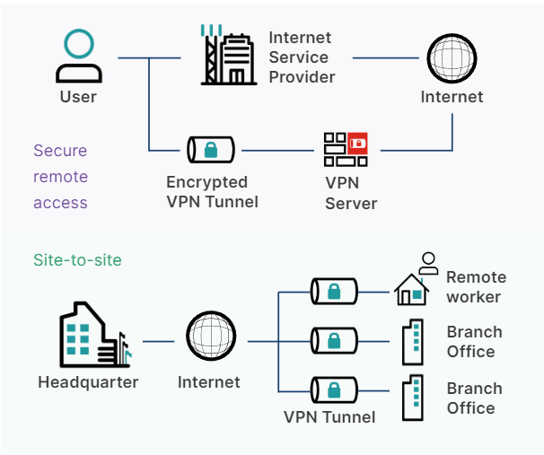
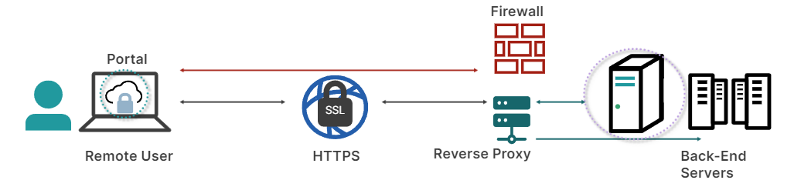
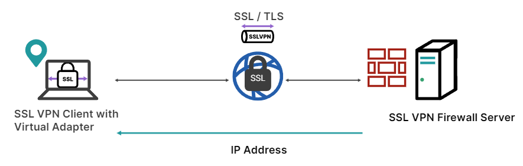
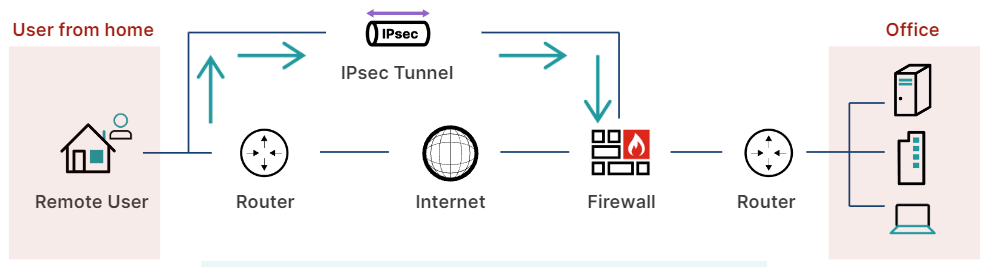
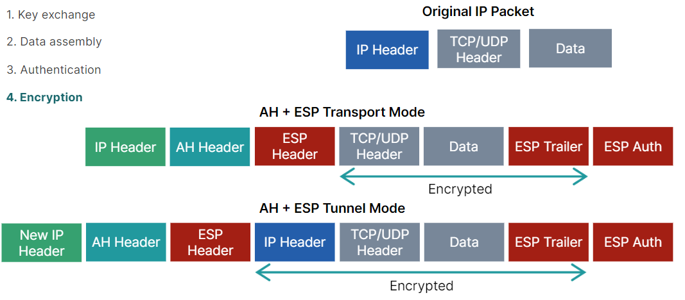

# Secure Remote Access

- [Secure Remote Access Overview](##-Secure-Remote-Access-Overview)
- [SSL VPN](##-SSL-VPN)
- [IPsec VPN](##-IPsec-VPN)
- [Zero Trust Network Access (ZTNA)](Zero-Trust-Network-Access-(ZTNA))

## Secure Remote Access Overview

Es  una  combinación  de  métodos  y  tecnologías  de  seguridad  que  permiten  que  entidades  finales  externas  se  conecten  a  las redes,  sin  comprometer  los  activos  digitales  ni  exponer  las  redes  a  partes  no  autorizadas

Posee tres caracteristicas en comun autenticacion, autorizacion y accounting "estado de cuentas" (AAA)

 Hay  tres  métodos  comunes  para  el  acceso  remoto  seguro:

 - Red  Privada  Virtual  (VPN):  es  una  conexión  privada  a  través  de  una  red  pública  que  permite  a  un  usuario  intercambiar  datos  de  forma  segura  con  una  red  privada,  como  si  su  dispositivo  informático  estuviera  conectado  directamente  a  la  red  privada

    -   VPN  de  sitio  a  sitio  (IPsec  VPN):  Es  una  conexión  entre  dos  o  más  redes,  como  una  red  corporativa  y  una  red  de  sucursal
    -   VPN  de  acceso  remoto  seguro (SSL VPN): Es  una  conexión  entre  un  usuario  remoto  y  una  red, se  compone  de  un  cliente,  un  servidor  y  protocolos

    

- Zero  Trust  Networking  Access  (ZTNA): Aplica  el  principio  de  confianza  cero,  ningún  usuario  o  dispositivodentro  o  fuera  de  una  red,  es  confiable

| Traits |  IPsec  VPN | SSL  VPN | ZTNA |
|--------|---------|----------|--------|
| Level of the model OSI | Network | Transport to Application |Transport to Application |
| Whats implementation is required at the client? | VPN client appliction |Web browser application or an SSL VPN client application | ZTNA client |
What access control to network resources exists after a session is established? | No access control after user has established a VPN session | Some granular access control as SSL connects users to specific apps and services, such as an email app | Granular access control to specific aplications. Access control is based on user roles/policy, plus on-going security checks of the connected devices |
| Authentication | Authentication takes place between the VPN client application and the private network |  Authentication takes place by way of a login prompt from the browser after the SSL session is established | Both the user and the device go through an authentication process and are re-identified and checked each time access to an app is requested |
| Tunnel type | IPsec tunnel only | Sessiion-based or tunnel | Session-based only |
| Category | Industry standard | Vendor specific | Vendor specific |
| Configuration | <ul><li>Requires instalation</li><li>Flexible setup<ul><li>Mesh and star topologies</li><li>For clients or peer gateway</li></ul></li></ul> | <ul><li>Does not requires instalation, if using the web type</li><li>Simpler setup<ul><li>Only client FortiGate</li><li>No user-configured setting</li></ul></li></ul> | <ul><li>Requires the instalation of a ZTNA client</li><li>Simpler setup<ul><li>Only client FortiGate</li><li>No user-configured setting</li></ul></li></ul> |

 

 

## SSL VPN
---
Es  una  tecnología  que  permite  una  sesión  cifrada,  junto  con  otras  funciones  de  seguridad,  entre  dos dispositivos  informáticos  y  proporciona  seguridad  desde  la  capa  de  transporte  del  modelo  OSI,  mientras  se  comunican  datos  en  la capa  de  aplicación

Requiere  un  cliente (navegador) y  un  servidor (servidor web)

Garantiza  la  privacidad,  la  integridad  de  los  datos,  la  autenticación  y  la  
funcionalidad  anti reproducción

La  seguridad  la  proporciona  el  protocolo  de  seguridad  de  la  capa  de  transporte (TLS)  en  la  capa  de  transporte  del  modelo  OSI. TLS  sucedió  al  protocolo  de  capa  de  sockets  seguros  (SSL),  ahora  obsoleto, SSL  se  ha  convertido  en  sinónimo  de  TLS

El  servidor no  es  necesariamente  un  servidor  web  dedicado;  podría  ser  un  firewall  con  funcionalidad  de  servidor  web

- Pasos:

    1. Los  usuarios  remotos establecen  una  conexión  segura  mediante  HTTPS

        El  servidor  SSL  VPN  puede  actuar  como  un  proxy  inverso ( es  una  aplicación  que  se  encuentra  delante  de  las  aplicaciones  backend  y reenvía  solicitudes  a  esas  aplicaciones) un  proxy  inverso  puede  retransmitir  información  a  un  servidor  web,  se implementa  por  razones  de  seguridad,  rendimiento  y  escalabilidad, ademas puede  reenviarla  a  servidores  backend  mediante  un  protocolo  diferente,  como  RDP,  SSH,  etc

        

    2. Los  usuarios  proporcionan  credenciales  para  pasar  una  comprobación  de autenticación

    3. El  servidor asigna  una  dirección  IP  al  adaptador  de  red  virtual  del  cliente.  La  IP  se  asigna  solo  para esta  sesión

    4. El  firewall  muestra  el  portal SSL  VPN  que  contiene  servicios  y  recursos  de  red  para  que  los  usuarios  accedan

        

- Desventajas:

    1. Todas  las  interacciones  con  la  red  interna  deben realizarse  mediante  el  navegador  web

    2. La  limitación  de  lo  que  se  puede  acceder  en  la  red, el  mecanismo  de  puerta  de  enlace  HTTP/HTTPS solo  admite  unos  pocos  protocolos  populares,  como  FTP

    3. Se  debe  instalar  un  cliente  VPN  en  el punto  final

 

 

## IPsec VPN
---

Es  la  tecnología  que  garantiza  la  privacidad  e  integridad  de  los  datos  entre  dos  o  más  dispositivos  informáticos  y  proporciona  seguridad  en  la capa  de  red  del  modelo  OSI

Requiere  un  cliente y  un  servidor (podría  ser  un  cortafuegos  o  un  enrutador  con  capacidades)

Se puede configurar de dos modos:

- **Tunel:** Se  protegen  más  componentes  de  los  paquetes  de  datos
- **Transporte:**

Autenticacion de paquetes:

- **Protocolo  de  encabezado  de  autenticación  (AH):** garantiza  la  integridad  y  la  autenticidad  del  origen  de  los  datos,  y garantiza  la  protección  contra  ataques  de  repetición

- **Protocolo  de  carga  útil  de  seguridad  encapsulante  (ESP):**  los  paquetes  se  cifran  entre  los  dos  puntos

Durante  la  conexión  inicial entre  el  cliente  y  el  servidor,  ambos  aceptan  determinados  atributos  de  seguridad  que  definirán  la  sesión.  
Estos  atributos  de  seguridad  incluyen  qué  algoritmos  criptográficos  y  parámetros  de  red  se  utilizarán.  
Se  genera  una  clave  de  sesión  que  cifrará  el  flujo  de  datos  entre  los  dos  puntos(protocolo  intercambio  de  claves  de  Internet  (IKE))  
Se  determinan  todos  los  atributos  de  seguridad  para  la  sesión  y  se  genera  una  clave  de  sesión  para  cifrar  los  datos  de  la  sesión futura  

Los paquetes   contienen  una  carga  útil "Payload" (  datos  reales,  encabezados, metadatos e informacion sobre estos)  
IPsec  agrega  varios  encabezados  a  los  paquetes  de  datos  que  contienen  información  de  autenticación  y  cifrado  
Cuando se habilita (ESP)  IPsec agrega  trailers,  que  van  después  de  la  carga  útil  de  cada  paquete,  esto  significa  que  hay  dos  capas  de  cifrado:  la sesión  cifrada  iniciada  por  IKE  y  el  cifrado  de  los  paquetes  
IPsec (ESP) cifra  la  carga  útil  dentro  de  cada  paquete  y  el  encabezado  IP  de  cada  paquete

IPsec  proporciona  autenticación  para  cada  paquete (sello de autenticidad)  garantiza  que  provengan  de  una  fuente  confiable  
Utiliza  el  protocolo  de  datagramas  de  usuario  (UDP)  como  protocolo  de  transporte

 

 

## Zero Trust Network Access (ZTNA)
---

ZTNA  establece  una  sesión  segura  entre  una  entidad  final  y  una  red,  al  tiempo  que  garantiza  un  control  granular  sobre  el  acceso  a  los recursos  y  ejerce  confianza  cero,  independientemente  de  la  ubicación  de  la  entidad  final  o  de  la  red.  
Parte  del  principio  de  confianza  cero  es  la  práctica  del  acceso  con  el  <u>mínimo  privilegio.</u>  Los  usuarios  solo tienen acceso  a  los  recursos  necesarios  para  cumplir  con su  trabajo   
ZTNA  es  específico  del  proveedor